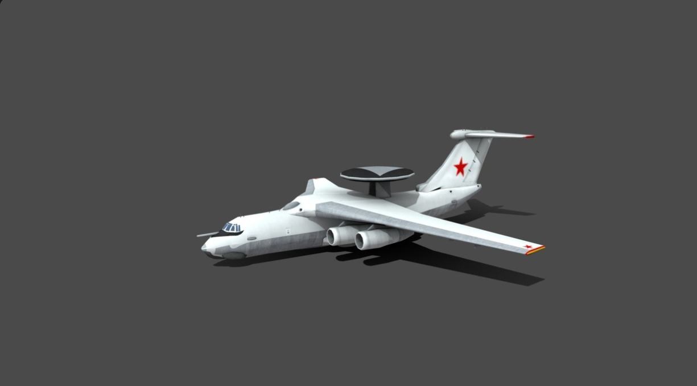

# Kullanılacak Karakterler ve Nesneler

FlyAR oyununda, çocukların eğlenceli bir şekilde öğrenmelerini sağlayacak çeşitli karakterler ve nesneler bulunmaktadır.

## Ana Karakterler

- **Kaşif Çocuklar:** Oyuncunun seçebileceği farklı özelliklerde çocuk avatarları (farklı kültürlerden, farklı kıyafetlerle)
  
  

- **Bilge Rehber:** Çocuklara oyun boyunca rehberlik eden, bilgi veren ve yönlendiren karakter
  
  

- **Yerel Rehberler:** Her ülke ve şehre özgü, o bölgenin kültürünü temsil eden rehber karakterler
  
  
  
  

## Uçuş Araçları

- **Sihirli Halı:** Geleneksel masallara gönderme yapan, renkli dokulu uçan halı

- **Mini Roket:** Futuristik tasarımlı, çocuk dostu mini roket
  
  
  
- **Uçan Balon:** Renkli ve neşeli tasarımlı sıcak hava balonu

- **Kanat Takımı:** Çocukların kendilerini kuş gibi hissetmelerini sağlayan kanat sistemi

## Toplanabilir Nesneler

- **Harfler:** Şehir ve ülke isimlerini oluşturan renkli, parlak 3B harfler

- **Özel Rozetler:** Her bölgeye özgü, o bölgenin kültürel özelliklerini yansıtan dijital rozetler

- **Bilgi Parçaları:** Toplandığında ekstra bilgi açığa çıkaran minik semboller

- **Güç Artırıcılar:** Oyun sırasında geçici olarak hız, manyetik çekim gibi özellikler sağlayan nesneler

## Engeller ve Zorluklar

- **Bulut Engelleri:** Farklı şekillerde, sağa sola manevra gerektiren bulut formasyonları

- **Hava Akımları:** Oyuncuyu farklı yönlere sürükleyen görsel efektli rüzgar akımları

- **Uçan Nesneler:** Kuşlar, uçurtmalar gibi oyuncunun kaçınması gereken hareketli nesneler

- **Zaman Sınırlamaları:** Belirli görevlerde süre kısıtlaması getiren saatler

## Arka Plan Öğeleri

- **Gökyüzü Temaları:** Her bölgenin karakteristik gökyüzü görünümü (gün batımı, parlak güneş, yıldızlı gece)

- **Yer Şekilleri:** Uzaktan görünen dağlar, göller, denizler
  
  

- **Kültürel Simgeler:** Uzaktan seçilebilen, bölgenin ikonik yapıları ve doğal güzellikleri
  
  
  
  

- **Hava Durumu Efektleri:** Bölgelere özgü hava durumu efektleri (hafif kar, yağmur, sis) 